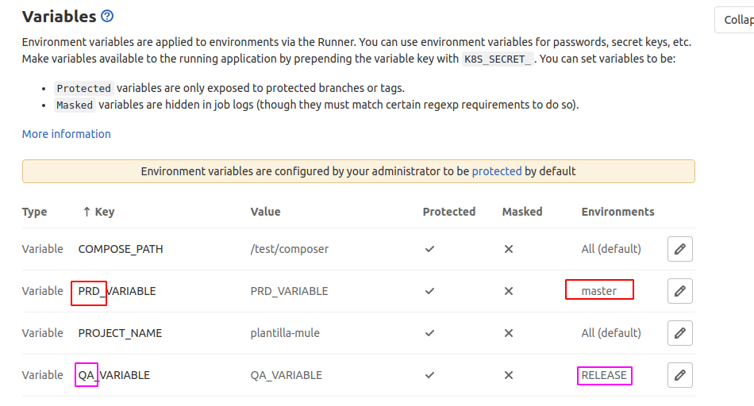

# AUTODEPLOY

## Configuración YML

### App

copiar el archivo [.gitlab-ci.yml](https://gitlab.com/developers.ieduca/devops/gitlab-ci-template/-/raw/master/ejemplos/v1/contenedor/.gitlab-ci.yml)  en la raiz del repositorio

modificar los tags con el nombre de los runners respectivos

Las variables de QA se colocan en el before_script del job deploy_release

Las variables de PRD se colocan en el before_script del job deploy_prod

> **No son necesarias las variables REGISTRY_IMAGE,IMAGE_VERSION y PROJECT_NAME en los exports.** 

Solo es necesario las variables que son usadas por el contenedor en el docker-composer.

### Composer

Copiar el archivo [.gitlab-ci.yml](https://gitlab.com/developers.ieduca/devops/gitlab-ci-template/-/raw/master/ejemplos/v1/composer/.gitlab-ci.yml)  en la raiz del repositorio

modificar los tags con el nombre de los runners respectivos

## Configuración de repositorio

### Environments

Crear 3 enviroments  master, SNAPSHOT y RELEASE

### Proteger Branchs

### Proteger Tags

### Variables

#### APP

Los repositorios de app deben configurarse  las variables COMPOSE_PATH y PROJECT_NAME

las variables adicionales se deben configurar de acuerdo a su ambiente  

Las variables que contienen información sensible se configuran en el grupo y solo lo puede hacer el administrador(owner)

#### Composer

Los repositorios composer deben tener la variable   COMPOSE_PATH de la carpeta donde estara el composer

#### 

